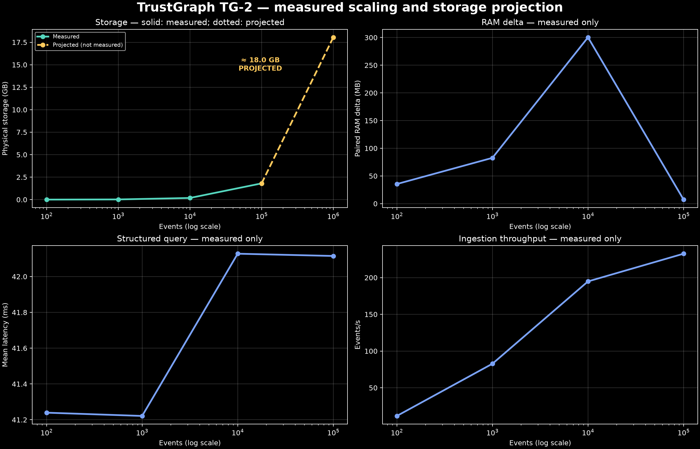
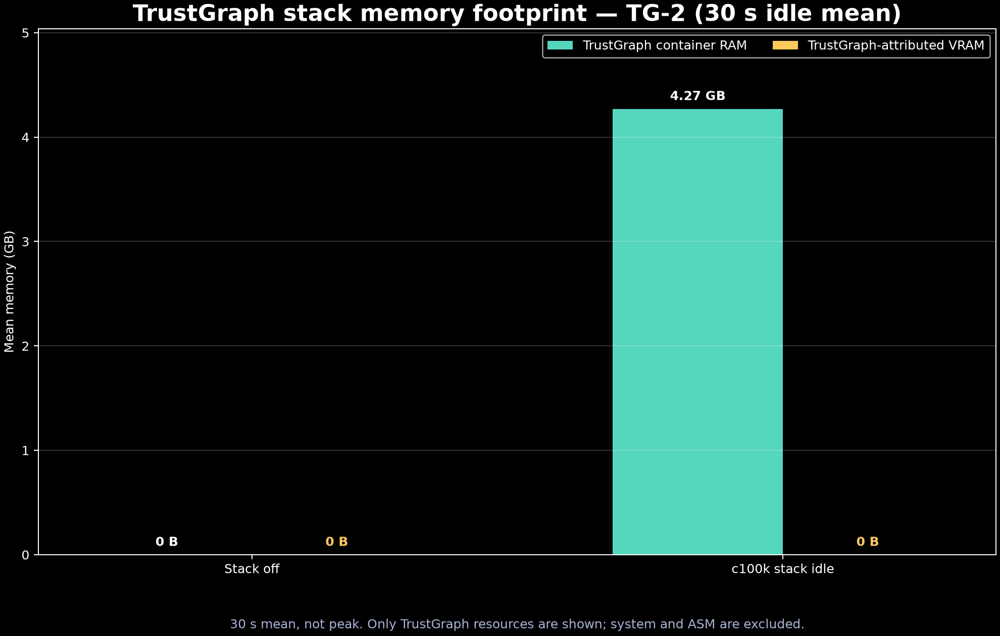
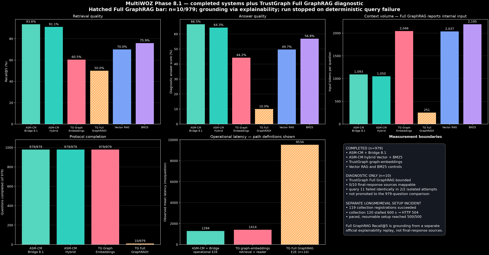

# TrustGraph vs. ASM-CM: What 2,500 GitHub Stars Don't Tell You About Memory, Reliability, and Integration Cost

*A reproducible comparison of graph-based persistent memory and compact neural associative memory*

> **Editorial note.** The star count in this working title is not a benchmark metric.
> It must be checked against a dated public snapshot immediately before publication.

Persistent AI memory is not one problem and “memory” is not one resource. A system may
persist an explicit representation, update an associative state, archive canonical
payloads, retrieve evidence, or assemble context for a reader model. Those operations
place costs in different locations: RAM, VRAM, disk, indexes, databases, networked
services, and reader tokens.

This distinction is the premise of this benchmark. TrustGraph and ASM-CM both support
persistent-memory workflows, but they represent memory in fundamentally different ways.
TrustGraph is not itself a neural memory model; it is an AI/context infrastructure
platform. ASM-CM is itself a learned neural memory model.

The purpose of this study is not to decide which description is more fashionable. It is
to measure where each architecture places cost, what capability it retains, and how it
behaves under declared workloads.

## Why this benchmark exists

This benchmark originated after a technical outreach exchange exposed a disagreement
about how persistent AI memory should be represented and evaluated. Rather than continue
that disagreement rhetorically, I chose to measure the architectural consequences under
controlled workloads.

The benchmark evaluates systems, not personalities. Harness mistakes, invalid runs, and
results unfavorable to ASM-CM are retained when they affect interpretation.

## Two representations of memory

### Graph reification

Graph reification turns an assertion into an addressable object. A relation such as:

```text
Alice -- works_at --> Acme
```

can become a statement with its own source, timestamp, confidence, authorization, and
validity metadata:

```text
Statement_847
├── subject     → Alice
├── predicate   → works_at
├── object      → Acme
├── source      → contract_17
├── confidence  → 0.97
└── observed_at → 2026-08-01
```

This explicitness supports inspection, provenance, graph traversal, and structured
queries. It also means that facts, relationships, metadata, storage records, and indexes
accumulate as represented knowledge grows.

### Learned associative state

ASM-CM takes a different approach. Experience updates a learned associative state; the
state does not require a distinct graph node for every assertion. Exact source text and
provenance may still be stored externally by the Memory Bridge when exact recovery is
required.

```text
experience → neural update → associative state
                          └→ canonical payload store, when required
```

This yields a narrower, testable scaling hypothesis: the neural associative state may
remain bounded even while canonical payload storage grows. It does **not** imply that
total ASM-CM storage, runtime RSS, update compute, or retrieval quality is constant.

The architectural distinction can be summarized as:

> **Graph reification turns memories into explicit addressable facts. ASM-CM turns
> experience into an evolving learned state.**

Neither representation is automatically superior. Explicit representation offers
auditability and graph-native inspection. Learned state may offer compact associative
continuity. The benchmark measures the price and retained capability of both choices.

## Systems under test

### TrustGraph

TrustGraph 2.8 exposes more than one retrieval path. They must not be collapsed into a
single label:

- **graph-embeddings retrieval** returns an embedding-ranked graph result;
- **Full GraphRAG** performs concept extraction, graph exploration, reranking, prompt
  construction, and synthesis;
- **DocumentRAG vector** retrieves dense document chunks;
- **DocumentRAG keyword/BM25** performs lexical retrieval;
- **DocumentRAG hybrid** combines dense and lexical retrieval;
- **structured graph query** audits triples and provides a reader-free control.

The completed 979-question comparison in this article evaluates **graph-embeddings
retrieval**, not TrustGraph as a whole and not the complete Full GraphRAG pipeline.

### ASM-CM and Memory Bridge

- **ASM-CM** is the learned associative memory state;
- **Memory Bridge** handles orchestration, evidence assembly, payload access, policy, and
  integration with the reader;
- **canonical payload storage** is separate from the neural state;
- **the reader** is a separate inference layer and is accounted separately.

The promoted Phase 8.1 result uses frozen ASM retrieval IDs, compacted evidence, and a
Qwen3 14B reader. Its operational resource replay does not rerun neural retrieval.

## Fairness and paired protocol

The main functional comparison freezes 979 support-valid questions derived from
MultiWOZ 2.2. For the graph-embeddings comparison, each question searches only its
closed 16-memory bundle. The paired systems use:

- the same 979 question IDs and ground truth;
- top-k = 5;
- the same Qwen3 14B reader;
- the same reader prompt and evaluator;
- the same candidate bundle where applicable;
- actual provider-reported reader input tokens;
- separate retrieval and reader measurements.

The accounting deliberately does not mix:

- setup and indexing with steady-state query latency;
- RAM with VRAM;
- disk with active state;
- retrieval quality with reader quality;
- a diagnostic smoke of 10 questions with a full run of 979;
- harness configuration errors with product behavior.

The TrustGraph preparation path is reported as collection setup, ingestion submission,
and indexing readiness. Those phases are not added to raw query latency; an amortized
value is reported separately.

## Integration experience

Architectural capability does not erase integration cost.

The paired TrustGraph integration required compatibility handling for the SDK embeddings
response shape, explicit collection registration, asynchronous indexing barriers,
IAM/bootstrap configuration, and checkpoint/resume support. The benchmark runner handled
these issues externally; the TrustGraph package and containers were not patched.

An early Full GraphRAG configuration selected `nomic-embed-text`. Flow creation accepted
the value, but the deployed `TextEmbedding` implementation rejected it. That run was
excluded. The valid Full GraphRAG smoke used
`sentence-transformers/all-MiniLM-L6-v2`. Two IAM/bootstrap mistakes in the harness were
also documented and excluded rather than attributed to TrustGraph.

Full GraphRAG introduced a second observability problem. The public response did not
return directly mappable memory sources for the 10-question diagnostic sample. A
Recall@5-compatible grounding list therefore required an official explainability replay
and stable URI-to-memory mappings.

The attempted 979-question Full GraphRAG continuation later returned HTTP 504 while its
concept-extraction stage waited for text completion. Inspection showed concurrent GPU
contention: 99% utilization and 21,994 of 24,564 MiB allocated. Because the public
gateway timed out before the internal request, early retries could overlap outstanding
work. These attempts remain an operational diagnostic, not an isolated TrustGraph
reliability rate.

A subsequent isolated attempt exposed a distinct failure mode. TrustGraph expected its
dedicated Ollama endpoint at `172.19.0.1:11435`; when that endpoint was absent, GraphRAG
reported the generic error `LLM returned no response`, while the container log exposed
the underlying connection refusal. After the dedicated endpoint was restored, the very
first Phase 8.1 question still returned HTTP 504. The gateway had expired, but Ollama
continued the abandoned internal generation beyond 25,000 decoded tokens. The configured
330-second client retry could therefore begin while the previous backend generation was
still consuming compute. Waiting longer did not make that execution a valid latency or
reliability measurement.

The benchmark stopped that configuration and did not merge its ten earlier smoke rows
with the corrected run. The correction uses a dedicated model alias,
`qwen3:14b-pmsb-bounded`, with `/no_think` and `num_predict=1024`, plus a new flow,
collection namespace, and `v2` result artifact. TrustGraph source and container images
remain unmodified: the containment is entirely in the reproducibility harness. A clean
one-question validation then completed without retry or gateway timeout: Full GraphRAG
took 17.38 seconds and its separate explainability replay took 8.44 seconds. It reported
257 internal input tokens and 1,127 output tokens; grounding Recall@5 succeeded, while
the diagnostic answer score was zero. This validates completion of the bounded path, not
its final quality. The clean 979-question execution is pending.

This sequence is itself part of the measured integration cost. Obtaining a reproducible
Recall@5 experiment required endpoint isolation, model-output bounds, checkpointing,
non-overlapping retries, separate explainability calls, stable source mapping, and strict
separation of invalid and corrected artifacts. A system can be architecturally capable
and still impose unnecessary operational friction on the people trying to use it
correctly.

The corrected run subsequently completed ten questions but failed on
`multiwoz:test:PMUL0815.json:train:train-leaveat` because an internal GraphRAG component
attempted to parse JSON from a `None` value. We then executed that question alone against
the same bounded flow and canonical indexed collection. It failed identically on both
isolated attempts, using a two-second diagnostic backoff. This makes accumulated state
after ten requests an unlikely explanation and identifies an input-dependent pipeline
failure under the tested configuration. The public exception does not identify which
internal stage produced the missing value, so no more specific root cause is claimed.

We did not skip the question and continue. Doing so would alter the frozen 979-question
protocol and conceal a reliability failure. The run remains a ten-question diagnostic,
not a completed Full GraphRAG result.

LongMemEval-S exposed another setup boundary before any retrieval or GPT-4o call. Its
paired isolation design required 500 candidate-bundle collections. TrustGraph registered
119 rapidly, but collection 120 remained pending for 600 seconds and surfaced as HTTP
504. The persisted collections were retained. A benchmark-side correction added
idempotent resume, a short-lived administrative client per attempt, bounded retries,
50 ms registration pacing, and per-collection logs. The resumed setup passed collection
120 and continued normally. This administrative failure is reported as integration
friction and is excluded from query and reader latency.

> A benchmark result is not only the final metric. It is also the operational path
> required to obtain that metric reproducibly.

## Resource accounting

### Persistent storage

The structured TrustGraph TG-2 workload measured physical storage at four checkpoints:

| Events | Physical storage | Repetitions | Status |
|---:|---:|---:|---|
| 100 | 2.14 MB | 3 | measured |
| 1,000 | 19.62 MB | 3 | measured |
| 10,000 | 183.09 MB | 3 | measured |
| 100,000 | 1.805 GB | 1 | measured, no confidence interval |
| 1,000,000 | 18.05 GB | — | projection, not measured |

The 1M point holds the largest-checkpoint bytes/event rate constant. It appears as a
dotted projection in the chart and is not used as an observation. Across 10k and 100k,
measured storage is consistent with approximately linear growth, near 18.0–18.3 kB per
event. This is not evidence of exponential growth.



### RAM

The public scaling panel uses **peak container RAM during the loaded window**:

| Events | TrustGraph stack peak RAM | Repetitions |
|---:|---:|---:|
| 100 | 4.47 GB | 3 |
| 1,000 | 4.55 GB | 3 |
| 10,000 | 4.72 GB | 3 |
| 100,000 | 4.81 GB | 1 |

A separate footprint experiment measured **30-second mean idle container RAM** at c100k:
4.27 GB, with a 4.30 GB peak in that window. The 4.81 GB scaling value and 4.27 GB
footprint value are different statistics, not contradictory reruns.

The ASM Phase 8.1 operational replay peaked at 115.3 MB RSS for the Bridge process. That
point is a frozen-retrieval replay, not an ASM 100→100k scaling curve, and is shown only
as an operational reference.

### VRAM

For the structured TrustGraph path, no GPU process memory was attributable to TrustGraph
in the measured stack-off or c100k-idle window. Total device VRAM changed because other
processes changed; the decrease is not “negative TrustGraph VRAM.” At c100k idle, the
30-second means were:

| Attribution class | Mean VRAM |
|---|---:|
| TrustGraph | 0 B |
| ASM | 0.908 GB |
| Other processes | 0.681 GB |
| Unattributed | 0.740 GB |

The result is limited to the structured path and tested deployment. Full GraphRAG with a
local reader has a separate model footprint.



### Active state and the missing ASM scaling curve

The ASM c100 paired TG-2 run measured a 143,608-byte logical neural state, 556,008 bytes
of runtime active state, a 564,795-byte snapshot, and 2,150,456 bytes of physical payload
storage. But this single point did **not** validate bounded scaling or utility:

- ingestion took 3,000.995 seconds for 100 events: **30.01 s/event**;
- throughput was **0.0333 event/s**;
- query latency averaged **3.586 s**;
- Recall@5 was only **8.75%**;
- Bridge peak RSS was 1.709 GB and attributable peak VRAM was 1.007 GB in that run.

This is an important negative ASM-CM result. The measured adapter was both slow and low
quality on the synthetic TG-2 workload. Running the same implementation to 100k would be
computationally impractical, and the benchmark does not extrapolate unmeasured ASM
checkpoints.

### A plausible scaling path: parallel instances

The c100 result measures single-instance ingestion, not the maximum aggregate throughput
of a horizontally scaled service. Independent agents or namespaces can, in principle,
be partitioned across separate ASM-CM workers:

> **ASM-CM currently has lower single-instance ingestion throughput because updates are
> sequential within a causal stream. Independent namespaces can be distributed across
> parallel workers, but horizontal scaling was not evaluated in this benchmark.**

```text
worker 1 → namespaces 1–N
worker 2 → namespaces N+1–2N
worker 3 → namespaces 2N+1–3N
```

Compact retained state per namespace makes this a natural mitigation for aggregate
throughput. It does not remove the causal dependency inside one history. If update
`t + 1` depends on the state produced by update `t`, distributing successive events from
that same stream across workers does not automatically reduce its 30.01-second measured
per-event latency.

The defensible distinction is therefore:

- **single-stream latency:** currently limited by sequential causal updates in the
  measured adapter;
- **aggregate multi-agent throughput:** potentially scalable by distributing independent
  namespaces across workers, but not measured here.

A future instance-scaling experiment should run 1, 2, 4, 8, 16, and 32 workers and
measure aggregate events/second, per-stream latency, RAM and VRAM added per worker,
agents per GPU, scaling efficiency, and cost per 1,000 agents. Until that experiment is
completed, horizontal scalability is an architectural hypothesis rather than a benchmark
result.

The current evidence therefore supports a design hypothesis—not an empirical scaling
claim:

> **The archive may grow. The memory state does not have to.**

Demonstrating that claim still requires multiple paired checkpoints showing both bounded
state and useful retrieval. Compact state without useful recall is not sufficient.

## Paired Phase 8.1: graph embeddings

The central completed comparison contains 979/979 questions:

| System | Recall@5 | Answer score | Reader input tokens |
|---|---:|---:|---:|
| ASM-CM + Memory Bridge 8.1 | **93.56%** | **66.59%** | **1,070,228** |
| TrustGraph graph embeddings | 60.47% | 44.22% | 2,002,598 |
| Vector RAG | 69.97% | 49.68% | 1,994,408 |
| BM25 | 75.89% | 56.85% | 2,148,717 |

Relative to TrustGraph graph embeddings, ASM-CM + Bridge achieved:

- **+33.09 percentage points** Recall@5;
- **+22.37 percentage points** diagnostic answer score;
- approximately **46.56% fewer** reader-input tokens.

The promoted ASM Phase 8.1 raw result reports 66.586% answer score. A separate operational
resource rerun reports 66.480% while reproducing the same 1,070,228 input tokens. The
article uses the promoted result for the primary quality table and the rerun only for
operational resource and wall-time measurements.



Hatched Full GraphRAG bars are a failed-run diagnostic (`n=10/979`), not a promoted
comparison against the completed systems. Grounding, internal input tokens, and
end-to-end latency are labeled separately because they are not semantically identical
to final-response source recall, reader context, or reader-only latency.

This result evaluates TrustGraph graph-embeddings retrieval, not the complete Full
GraphRAG pipeline. It also does not establish that every TrustGraph retrieval mode would
produce the same ranking.

## Operational latency

The completed graph-embeddings path measured:

| Phase | Mean | p50 | p95 | Max |
|---|---:|---:|---:|---:|
| TrustGraph retrieval | 178.5 ms | 175.4 ms | 265.0 ms | 356.4 ms |
| Shared reader | 1,235.6 ms | 1,203.3 ms | 1,652.1 ms | 3,635.2 ms |
| Combined | 1,414.1 ms | 1,382.8 ms | 1,829.7 ms | 3,759.8 ms |

The ASM operational Phase 8.1 rerun took 1,266.94 seconds for 979 questions, or
approximately 1,294.1 ms/question from total wall time. TrustGraph was 9.3% slower before
preparation. Amortizing 21.22 seconds of collection setup, ingestion submission, and
indexing readiness raises the TrustGraph effective mean to 1,435.8 ms/question, 10.9%
above the ASM operational run.

The runs did not have identical contention conditions: the ASM operational replay shared
the GPU with separate training. Latency should therefore be interpreted as operational,
not as a clean isolated microbenchmark.

An intermediate 395/979 estimate suggested an 18–20% difference. The completed run did
not confirm it, so the estimate was replaced with the final 9.3%/10.9% result. Preserving
that correction is part of the experimental record.

## Full GraphRAG: diagnostic smoke only

> **Diagnostic smoke, n=10 — not final protocol result.**

| Metric | Full GraphRAG smoke |
|---|---:|
| Grounding Recall@5 | 50.00% |
| Diagnostic answer score | 21.05% |
| Mean end-to-end latency | 19.53 s/question |
| Internal input tokens | 2,352 total |
| Output tokens | 9,259 total |
| Public response sources mappable to memory IDs | 0/10 |
| Explainability grounding mappings | 10/10 |

The 50% value does not come from final-response sources. It uses the ordered
`Exploration.entities` list from an official explainability replay mapped back to frozen
memory IDs. Explainability averaged a separate 20.69 s/question and is not added to the
end-to-end latency above.

The public output used here did not expose a directly mappable ranked top-five source
list. When an observable mapping does not exist, the benchmark reports “not available”
rather than inferring provenance from generated text.

The incomplete 979 continuation does not replace this smoke and contributes no final
quality claim. Its contention-affected 504 sequence and the later isolated unbounded
generation are integration diagnostics. The corrected bounded run starts a new
homogeneous `v2` artifact at 0/979; reusing the old rows would mix materially different
runtime configurations.

## DocumentRAG controls

The implementation plan requires independent DocumentRAG vector, keyword/BM25, and
hybrid/RRF controls because Full GraphRAG results may depend on dense or lexical
components within the same platform.

**Pending — not included in current conclusions.**

Structured graph query results are available only as reader-free TG-2 integrity and
latency controls; they are not substituted for free-language answer quality.

## Results summary

| Metric | ASM-CM + Bridge | TG graph embeddings | TG Full GraphRAG | DocumentRAG vector | DocumentRAG keyword | DocumentRAG hybrid |
|---|---:|---:|---:|---:|---:|---:|
| Protocol size | 979 | 979 | 10 diagnostic | pending | pending | pending |
| Recall@5 | **93.56%** | 60.47% | 50.00% grounding | N/A | N/A | N/A |
| Answer score | **66.59%** | 44.22% | 21.05% | N/A | N/A | N/A |
| Reader input tokens | **1.070M** | 2.003M | 2,352 internal total | N/A | N/A | N/A |
| Retrieval latency | frozen replay | 178.5 ms mean | inseparable E2E | N/A | N/A | N/A |
| Operational/E2E latency | 1,294.1 ms/q | 1,414.1 ms/q | 19.53 s/q | N/A | N/A | N/A |
| Memory-layer RAM | 115.3 MB Bridge peak¹ | 4.27 GB TG stack mean² | not isolated | N/A | N/A | N/A |
| Attributable VRAM | 0 B Bridge¹ | 0 B structured path² | reader not isolated | N/A | N/A | N/A |
| Persistent disk scaling | only c100 measured | 1.805 GB at c100k | not isolated | N/A | N/A | N/A |
| Setup/index readiness | frozen replay | 21.22 s | measured separately in smoke | N/A | N/A | N/A |
| Provenance | payload IDs | graph/entity IDs | explainability replay required | N/A | N/A | N/A |
| Integration status | direct replay path | completed | 979 pending | pending | pending | pending |

¹ Phase 8.1 operational replay, not an ASM scaling point; reader excluded.<br>
² TrustGraph c100k stack footprint, a different workload from Phase 8.1.

The wide table intentionally contains N/A values. Filling them by inference would make
the comparison look more complete while making it less reproducible.

## What the results mean

In the paired structured MultiWOZ workload, ASM-CM + Memory Bridge achieved higher
Recall@5, higher answer quality, lower reader-context volume, and lower operational
latency than TrustGraph graph-embeddings retrieval.

TrustGraph's structured memory path placed most observable resource cost in CPU-resident
infrastructure and persistent storage rather than attributable GPU memory. Its measured
physical storage grew approximately linearly through 100k events, while the stack used
roughly 4.5–4.8 GB peak container RAM across the measured checkpoints.

The paired result did not show ASM-CM trading retrieval quality for compactness. Under
this particular structured protocol, compactness and retrieval quality improved
simultaneously. However, that result does **not** generalize to the synthetic TG-2
workload: the measured ASM c100 adapter achieved only 8.75% Recall@5 and required 30.01
seconds per event.

TrustGraph retains architectural advantages that these headline percentages do not
erase: explicit representation, graph-native inspection, and addressable provenance.
Those properties carried measurable RAM, storage, preparation, and integration costs in
the tested deployment.

This does not establish universal superiority over TrustGraph.

## Limitations

1. **Structured language.** The 979-question MultiWOZ protocol uses structured grammar
   and does not represent unrestricted conversation, broad paraphrase, or arbitrary
   anaphora.
2. **ASM free-language retrieval remains weak.** In the separate 128-question R3 test,
   the trained ASM context head achieved 15.62% Recall@5 versus 60.16% for vector and
   57.81% for BM25; the head was not promoted.
3. **TrustGraph has multiple retrieval paths.** Graph embeddings are not Full GraphRAG,
   and neither substitutes for DocumentRAG controls.
4. **Full GraphRAG is a smoke.** Ten questions cannot replace the frozen 979-question
   protocol.
5. **Hardware and deployment specificity.** Results come from a one-machine local
   deployment using TrustGraph 2.8-era containers, an RTX 4090 with 24,564 MiB, and the
   recorded database/vector stack.
6. **Runtime noise.** Container allocators, caches, compaction, flushes, and concurrent
   GPU workloads affect RAM and latency.
7. **Mean and peak differ.** The 4.27 GB c100k footprint is a 30-second mean; the 4.81 GB
   scaling value is a loaded-window peak.
8. **Projections are not observations.** The dotted 1M storage point is projected; ASM
   beyond c100 is not extrapolated.
9. **Reader dependence.** Qwen3 14B, its prompt, and the diagnostic evaluator influence
   answer score, tokens, and latency.
10. **No universal complexity claim.** A fixed neural-state design does not prove O(1)
    total RSS, disk, update compute, or useful capacity.
11. **Parallel instance scaling is unmeasured.** Independent ASM-CM namespaces are a
    natural target for horizontal workers, but parallelism is not treated as a substitute
    for improving the measured single-stream ingestion latency.

## Reproducibility

The inspected TrustGraph upstream is commit
`0bcfe9377c3d55b7199c16335b9e52ed91286233`, on the 2.8 line under Apache-2.0. The local
deployment used TrustGraph 2.8.12 service images with Cassandra 5.0.8, Qdrant 1.18.0,
Pulsar 4.2.1, Garage 2.3.0, and the recorded supporting services. The available
artifacts do not yet contain a complete digest inventory for every image; tags must not
be described as immutable digests.

Primary artifacts include:

- methodology: [`methodology/trustgraph_implementation_plan.md`](methodology/trustgraph_implementation_plan.md),
  [`methodology/trustgraph_phase81_integration_friction.md`](methodology/trustgraph_phase81_integration_friction.md),
  and [`methodology/graph_reification_vs_memory_state.md`](methodology/graph_reification_vs_memory_state.md);
- paired report: [`docs/report/011_trustgraph_phase81_paired.md`](docs/report/011_trustgraph_phase81_paired.md);
- paired raw result: [`results/raw/tg-phase81-paired-full-v3.json`](results/raw/tg-phase81-paired-full-v3.json),
  SHA-256 `952dff6285c772635dc59535df37b2259698f0b74876df4ad5d78e3343ec4756`;
- paired manifest: [`manifests/trustgraph-phase81-paired.json`](manifests/trustgraph-phase81-paired.json);
- scaling points: [`manifests/tg2-scaling-points.json`](manifests/tg2-scaling-points.json);
- VRAM attribution: [`manifests/tg2-vram-stack-comparison.json`](manifests/tg2-vram-stack-comparison.json);
- ASM operational point: [`manifests/asm-phase81-operational-point.json`](manifests/asm-phase81-operational-point.json);
- Full GraphRAG smoke: [`results/raw/tg-phase81-full-graphrag-smoke.json`](results/raw/tg-phase81-full-graphrag-smoke.json);
- ASM TG-2 c100: [`results/raw/asm-tg2-c100-r1.json`](results/raw/asm-tg2-c100-r1.json) and
  [`results/raw/asm-tg2-c100-r1-resource.json`](results/raw/asm-tg2-c100-r1-resource.json).

Runner-side compatibility handling is external to TrustGraph. Invalid preliminary runs
are excluded and documented: premature readiness, a global collection that violated the
closed-bundle protocol, unsupported embedding configuration, and harness IAM/bootstrap
errors.

The current artifact set still lacks three items required for a final frozen paper-like
release: complete DocumentRAG controls, Full GraphRAG 979/979, and a repeated useful ASM
scaling curve. Their absence is explicit rather than filled with estimates.

## Conclusion

TrustGraph and ASM-CM represent two fundamentally different approaches to persistent AI
memory. TrustGraph externalizes memory into explicit graph, vector, and database
infrastructure. ASM-CM attempts to preserve associative continuity inside a compact
learned state while keeping canonical payloads separate.

Under the paired structured workload reported here, ASM-CM + Memory Bridge achieved
better retrieval and answer quality with less reader context and lower operational
overhead than TrustGraph graph-embeddings retrieval. TrustGraph remains stronger in
explicit representation, provenance, and graph-native inspectability, but those
properties carry measurable storage, RAM, and integration costs.

The same artifact set also exposes the present ASM limitation: its paired synthetic c100
adapter was computationally slow and retrieved poorly. Compact representation is not the
same as cheap updates or useful scaling.

The benchmark does not ask which architecture is more fashionable. It asks where the
cost goes, what capability is retained, and what the system actually does when measured.

*This benchmark began with a disagreement. It ends with reproducible artifacts.*
