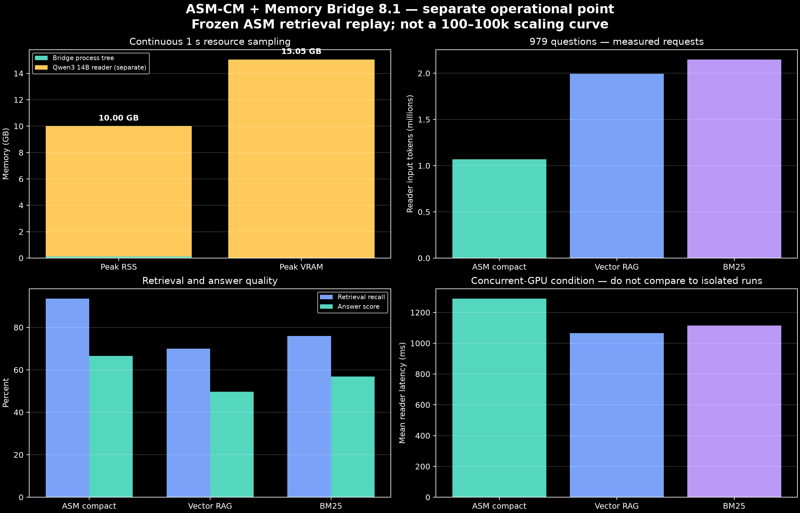

# ASM-CM + Memory Bridge 8.1 — ponto operacional separado

## Escopo

A Phase 8.1 completa foi reexecutada em um novo processo, sem pausar, reiniciar
ou modificar o treinamento ASM-CM existente. O run completou as 979 perguntas
MultiWOZ support-valid e foi amostrado externamente a cada 1 segundo.

Este ponto **não pertence à curva TG-2 de 100–100k eventos**. A Phase 8.1
reutiliza os IDs recuperados congelados da Phase 8 e mede o replay de evidências,
compaction determinística e reader. Ela não reexecuta o retrieval neural ASM-CM.

## Recursos

| Camada | Peak RSS | Peak VRAM |
|---|---:|---:|
| Processo ASM Memory Bridge 8.1 | 115.306.496 B | 0 B |
| Reader Qwen3 14B, serviço separado | 9.885.642.752 B | 15.049.162.752 B |

O reader já estava carregado antes do run:

- baseline RSS: 1.984.335.872 B;
- baseline VRAM: 15.047.065.600 B;
- pico incremental de RSS durante o run: 7.901.306.880 B;
- pico incremental de VRAM: 2.097.152 B.

A residência completa do reader e seu delta são preservados separadamente. O
processo de treinamento concorrente não foi incluído nem na árvore do Bridge nem
na árvore do Ollama. Como ambos compartilhavam a GPU, a latência do reader desta
execução deve ser interpretada como condição concorrente, não como substituição
do resultado isolado promovido.

## Resultado end-to-end

| Sistema | Recall | Answer score | Input tokens | Mean reader latency |
|---|---:|---:|---:|---:|
| ASM compact | 93,56% | 66,48% | 1.070.228 | 1.289,79 ms |
| Vector RAG congelado | 69,97% | 49,68% | 1.994.408 | 1.065,41 ms |
| BM25 congelado | 75,89% | 56,85% | 2.148.717 | 1.114,70 ms |

O total de input tokens do ASM compact reproduziu exatamente o resultado
promovido de 1.070.228. O answer score variou de 66,59% para 66,48%; o run ainda
passou os gates de preservação de qualidade, vantagem sobre vector RAG e economia
de tokens. A latência ASM compact aumentou sob contenção concorrente de GPU e não
deve ser comparada diretamente à latência histórica isolada de 855 ms.

## Separação dos blocos

1. **TrustGraph stack:** storage persistente, RAM de containers e VRAM atribuída;
2. **ASM-CM paired scaling:** neural state, runtime RAM e payload storage — ainda
   requer execução do mesmo workload TG-2 por checkpoint;
3. **Reader/end-to-end:** tokens, latência e qualidade da Phase 8.1.

## Proveniência

- janela completa: `results/raw/asm-phase81-tg2-full-resource.json`;
- manifest resumido: `manifests/asm-phase81-operational-point.json`;
- resultado original: `../asm-memory-bridge/runs/asm_memory_bridge_phase81_tg2_full/results.json`;
- duração: 1.266,94 s;
- amostras: 1.217;
- exit code: 0;
- decisão: promoted.
