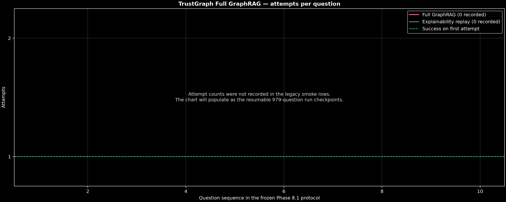

# TrustGraph graph-embeddings vs. ASM-CM + Bridge 8.1

## Escopo

Este resultado usa exatamente as 979 perguntas support-valid congeladas da Phase
8.1, o mesmo Qwen3 14B, prompt, top-k e avaliador. Cada pergunta pesquisa somente
seu bundle fechado de 16 memórias; os 979 exemplos correspondem a 37 bundles.

O sistema medido é **TrustGraph graph-embeddings retrieval**. Ele é uma ablação de
retrieval nativa do TrustGraph e **não é o pipeline completo de GraphRAG**.

## Resultado funcional pareado

| Sistema | Recall@5 | Answer score | Reader input tokens | Mean reader latency |
|---|---:|---:|---:|---:|
| ASM-CM + Bridge 8.1 | **93,56%** | **66,48%** | **1.070.228** | 1.289,8 ms |
| TrustGraph graph-embeddings | 60,47% | 44,22% | 2.002.598 | **1.235,6 ms** |
| Vector RAG | 69,97% | 49,68% | 1.994.408 | **1.065,4 ms** |
| BM25 | 75,89% | 56,85% | 2.148.717 | 1.114,7 ms |

Neste protocolo, o ASM obteve vantagem de 33,09 pontos percentuais em Recall@5 e
22,26 pontos em answer score sobre TrustGraph. O ASM enviou 46,56% menos tokens ao
reader; de forma equivalente, TrustGraph enviou 87,12% mais tokens.

O answer score de 66,48% é o rerun pareado. O resultado promovido anterior foi
66,59%. A diferença é registrada, não ocultada.


The complete chart separates promoted 979-question results from the hatched Full
GraphRAG diagnostic (`n=10/979`). Its Full GraphRAG Recall@5 is explainability grounding,
its token count is TrustGraph's reported internal input rather than reader-context
accounting, and its latency is end-to-end. These values are shown for operational
diagnosis and are not treated as a completed paired result.

## Latência

O retrieval TrustGraph adicionou 178,5 ms por pergunta antes do reader. Retrieval
e reader somaram 1.414,1 ms por pergunta. A execução operacional ASM completa
levou 1.266,94 s, equivalente a 1.294,1 ms por pergunta. Assim, o caminho
TrustGraph foi 9,3% mais lento sem preparação e 10,9% mais lento após amortizar
21,2 s de setup, ingestão e readiness pelas 979 perguntas.

A projeção parcial de 18–20% de lentidão, calculada em 395/979, não se confirmou e
foi substituída pelos valores finais. Essa correção é parte do registro metodológico.

| Fase TrustGraph | Mean | p50 | p95 | Max |
|---|---:|---:|---:|---:|
| Retrieval | 178,5 ms | 175,4 ms | 265,0 ms | 356,4 ms |
| Reader | 1.235,6 ms | 1.203,3 ms | 1.652,1 ms | 3.635,2 ms |
| Combined | 1.414,1 ms | 1.382,8 ms | 1.829,7 ms | 3.759,8 ms |

A latência histórica isolada de aproximadamente 855 ms do ASM não é usada como
comparador principal. O run ASM operacional ocorreu sob contenção de GPU por um
treinamento separado; as condições de runtime não são idênticas.

## Integration friction observed

TrustGraph proved considerably more operationally complex to integrate than
expected. The paired benchmark required SDK compatibility handling, explicit
collection registration, asynchronous indexing waits, and careful separation of
setup, ingestion, indexing, query, and reader latency.

A system can be architecturally capable and still impose unnecessary operational
friction on the people trying to use it correctly.

## Full GraphRAG extension — diagnostic smoke, not the final 979 result

The chart will retain the measured `graph-embeddings` ablation and add Full
GraphRAG as a separate system. Full GraphRAG is not represented by the 60.47%
graph-embeddings value.

The first valid Full GraphRAG diagnostic sample completed 10 frozen questions
with Qwen3 14B synthesis and the deployment-supported
`sentence-transformers/all-MiniLM-L6-v2` embedding model:

| Metric | Full GraphRAG smoke |
|---|---:|
| Questions | 10 |
| Grounding Recall@5 | 50.00% |
| Diagnostic answer score | 21.05% |
| Mean end-to-end latency | 19,529.8 ms/question |
| Internal input tokens | 2,352 |
| Output tokens | 9,259 |
| Final-response sources mappable to memory IDs | 0/10 |
| Explainability grounding mappings | 10/10 |

Grounding Recall@5 is derived from the ordered `Exploration.entities` list in an
official Full GraphRAG explainability replay. The replay averaged 20,687.8 ms per
question and is accounted separately; it is not added to the end-to-end latency.
The complete 979-question run is required before this diagnostic bar can be
presented as a result over the full paired protocol.

Obtaining this apparently simple Recall@5 number required explicit graph
construction, stable URI-to-memory mappings, isolated collections, graph and
embedding readiness barriers, a complete GraphRAG call, and a second official
explainability pass because the final public payload returned no mappable sources.
The complete operational record, including excluded harness errors, is maintained
in `methodology/trustgraph_phase81_integration_friction.md`.

### Full GraphRAG runtime reliability

During the attempted 979-question Full GraphRAG run, the first new request after the
10-question smoke returned HTTP 504 after approximately 5 minutes 34 seconds and stopped
the runner. The 10 completed rows remained intact. The resumable runner now checkpoints
per question and retries transient GraphRAG and explainability failures with exponential
backoff. Per-question attempt counts are retained so reliability failures and retry time
remain visible in the final operational measurements.



The attempts chart treats missing values from the original 10-question smoke as
unrecorded gaps. It does not assume that legacy rows succeeded on their first attempt.

The initial 504 sequence occurred under measured GPU contention from concurrent Qwen3
and ASM workloads (99% GPU utilization; 21,994/24,564 MiB allocated). It is preserved
as a diagnostic integration event, not treated as an isolated TrustGraph reliability
rate. The clean continuation must run after the competing reader workload releases the
GPU. Restarting or rebuilding graph and vector storage is not required.

### Bounded rerun and deterministic question failure

A later isolated run showed that contention was not the only operational issue. The
dedicated TrustGraph Ollama endpoint at `172.19.0.1:11435` first had to be restored;
without it, the public GraphRAG error was `LLM returned no response`, while the container
log showed the underlying connection refusal. Once connectivity was restored, the
gateway returned HTTP 504 while Ollama continued an abandoned internal generation beyond
25,000 decoded tokens. A retry after 330 seconds could therefore overlap backend work
that the client timeout had not cancelled.

The corrected deployment used the dedicated model alias
`qwen3:14b-pmsb-bounded`, `/no_think`, and `num_predict=1024`. It also used a new
flow, collection namespace, and `v2` artifact so that results from materially different
runtime configurations could not be merged. TrustGraph source code and container images
were not modified.

The bounded run produced the following ten-question diagnostic checkpoint:

| Metric | Bounded diagnostic |
|---|---:|
| Questions completed | 10/979 |
| Mean Full GraphRAG latency | 9,533.8 ms/question |
| Minimum / maximum latency | 7,428.5 / 12,803.5 ms |
| Diagnostic answer score | 10.00% |
| Internal input tokens | 2,512 |
| Output tokens | 7,021 |
| Final-response sources mappable to memory IDs | 0/10 |
| Grounding Recall@5 via explainability | 50.00% |

The next frozen question,
`multiwoz:test:PMUL0815.json:train:train-leaveat`, failed with:

```text
graph-rag-error: the JSON object must be str, bytes or bytearray, not NoneType
```

To test whether this was caused by accumulated state after ten requests, the question
was executed alone against the same bounded flow and the same canonical indexed
collection. Both isolated attempts failed with the identical exception. The diagnostic
used a two-second backoff to avoid waiting 330 seconds during reproduction and wrote to
a separate target. It did not modify the ten-row checkpoint.

This 2/2 isolated reproduction supports an input-dependent pipeline failure under the
tested configuration, rather than a failure caused merely by request position. The
public exception shows that an internal component attempted to parse JSON from a `None`
value, but it does not identify which internal stage produced that value; no more
specific root cause is asserted.

The runner was stopped at 10/979. The failing question was not skipped because skipping
would alter the frozen workload and conceal a reliability failure. Consequently, this
checkpoint is reported only as a diagnostic sample and cannot occupy the final
979-question Full GraphRAG comparison bar.

### Observed host concurrency

On this benchmark host, two local Ollama instances ran simultaneously, including a
Qwen3 14B reader, alongside two ASM-CM processes; another ASM-CM workload used an
external GPT-4o reader. Because GPT-4o was remote, it did not consume local model VRAM.
In the same loaded environment, the TrustGraph Full GraphRAG path repeatedly timed out
and did not advance beyond its existing checkpoint.

The defensible conclusion is limited to the tested deployment: TrustGraph could not be
added successfully to this host's active workload without serializing or reallocating
resources, whereas the concurrent ASM-CM processes remained operational. This is an
observed integration-capacity difference, not proof that TrustGraph cannot reach the
same concurrency with different hardware, remote inference or another configuration.

Os workarounds ficaram exclusivamente no runner do benchmark. Nenhum pacote,
container ou código do TrustGraph foi modificado.

## Interpretação

> **ASM-CM did not merely trade retrieval quality for compactness. In this paired
> structured workload, it simultaneously achieved higher Recall@5, higher answer
> quality, lower reader-context volume, and lower end-to-end latency.**

Esse resultado não autoriza uma afirmação universal sobre GraphRAG ou linguagem
livre. Ele demonstra apenas o comportamento desta ablação graph-embeddings no
protocolo estruturado MultiWOZ Phase 8.1. RAM, storage e scaling estrutural devem
permanecer em painéis separados.

## Proveniência

- manifesto: `manifests/trustgraph-phase81-paired.json`;
- resultado raw: `results/raw/tg-phase81-paired-full-v3.json`;
- SHA-256 raw: `952dff6285c772635dc59535df37b2259698f0b74876df4ad5d78e3343ec4756`;
- perguntas completas: 979/979;
- token accounting: completo;
- decisão: válido;
- parciais com readiness/corpus incorretos: excluídos.
