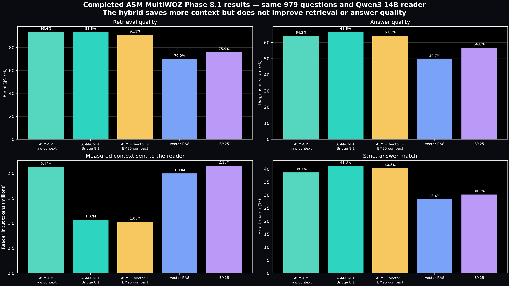
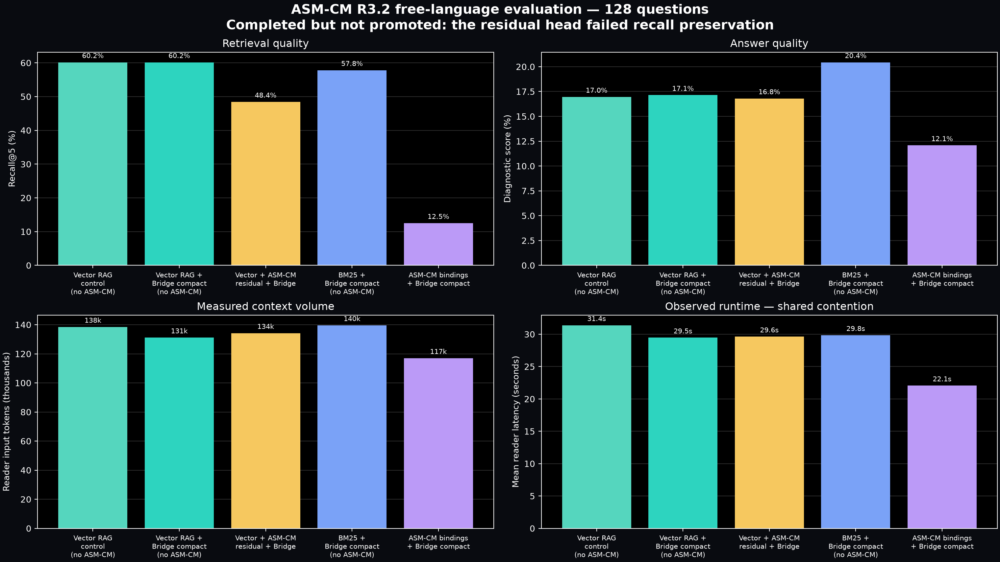
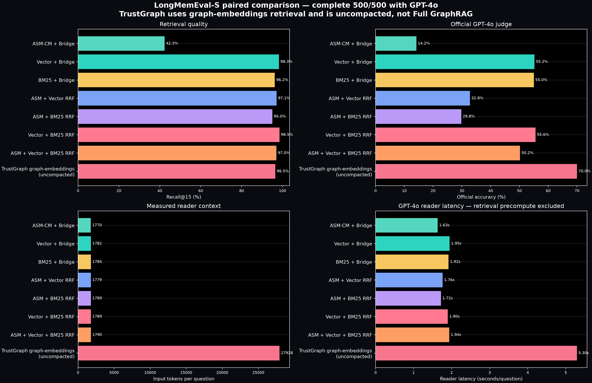
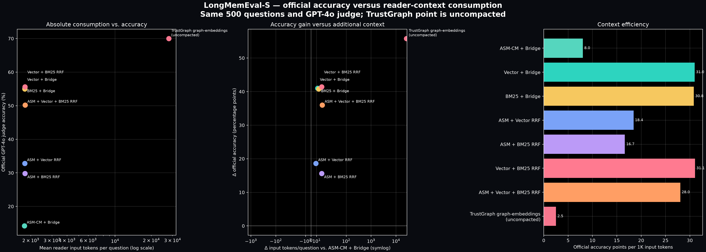

# Completed ASM results available before the final TrustGraph suite

These figures use only completed ASM artifacts and keep each protocol separate.

## MultiWOZ Phase 8.1 — 979 questions

The chart includes the raw ASM context, ASM-CM + Bridge 8.1, the completed
ASM + Vector + BM25 compact hybrid, Vector RAG, and BM25. All quality and token
values come from complete 979-question results. Hybrid reader latency is omitted
because that run completed under materially different GPU contention.

## R3.2 free-language evaluation — 128 questions

R3.2 completed all 128 questions for all five systems but was not promoted: the
residual head failed the frozen recall-preservation criterion. Reader latency is
shown as an observed runtime under shared contention, not an isolated performance
comparison.

## LongMemEval-S + GPT-4o — 500 questions

This chart includes seven compact systems plus one completed high-context TrustGraph
ablation. The seven internal systems share the top-15 budget, Bridge 8.1 compactor,
GPT-4o reader and official GPT-4o judge. The
ASM baseline is reused by hash; the RRF combinations are deterministic, equal-weight
and gold-blind.

| System | Recall@15 | Official accuracy | Mean input tokens | Reader latency |
|---|---:|---:|---:|---:|
| ASM-CM + Bridge | 42.33% | 14.20% | 1,770.2 | 1.63 s |
| Vector + Bridge | 98.30% | 55.20% | 1,782.0 | 1.95 s |
| BM25 + Bridge | 96.23% | 55.00% | 1,784.1 | 1.92 s |
| ASM + Vector RRF | 97.08% | 32.80% | 1,778.8 | 1.76 s |
| ASM + BM25 RRF | 95.03% | 29.80% | 1,789.4 | 1.72 s |
| Vector + BM25 RRF | **98.53%** | **55.60%** | 1,789.4 | 1.90 s |
| ASM + Vector + BM25 RRF | 97.02% | 50.20% | 1,790.5 | 1.94 s |
| TrustGraph graph-embeddings (uncompacted) | 96.48% | **70.00%** | 27,928.1 | 5.30 s |

On this external-generalization protocol, the pure ASM-CM path did not outperform
the lexical or vector controls. Vector + BM25 RRF produced the best measured Recall@15
and official accuracy. Adding ASM to RRF improved substantially over ASM alone but did
not improve the strongest Vector + BM25 combination.

The completed uncompacted TrustGraph graph-embeddings path achieved the highest official
accuracy, despite lower Recall@15 than Vector + BM25 RRF. An audit found that the runner
had omitted the Bridge 8.1 evidence transform, so this result is a valid high-context
ablation rather than a same-compactor result. It sent approximately 15.6x
as many input tokens per question as the compact internal systems and its GPT-4o reader
latency was approximately 2.8x the Vector + BM25 RRF reader latency. TrustGraph retrieval
itself averaged 100.9 ms/question; the table keeps retrieval and reader latency separate.
This result is graph-embeddings retrieval, not Full GraphRAG.

A corrected compact TrustGraph rerun and a five-system fixed-context ablation at 2k,
4k, 8k, 16k and 28k evidence tokens are in progress. The fixed-context run uses frozen,
gold-blind rankings and the same GPT-4o reader to isolate accuracy purchased per unit of
reader context.

### Consumption versus accuracy

Here, consumption means measured GPT-4o reader input tokens per question. Relative to
ASM-CM + Bridge, TrustGraph gained 55.8 official-accuracy points while adding 26,157.9
tokens/question. Relative to the strongest compact quality control, Vector + BM25 RRF,
TrustGraph gained 14.4 points while adding 26,138.7 tokens/question. Context efficiency
was 2.5 official-accuracy points per 1,000 input tokens for TrustGraph versus 31.1 for
Vector + BM25 RRF. RAM and VRAM are excluded because this LongMemEval run did not collect
them under a paired resource protocol.

The identical 26.55-second retrieval value attached to the derived hybrid systems is
not plotted as a per-system latency comparison because it represents reused ranking/cache
precomputation rather than an independently timed retrieval path for every system.

Both PNG and SVG versions are generated by `persistent_memory_scaling.asm_completed_plots`.
