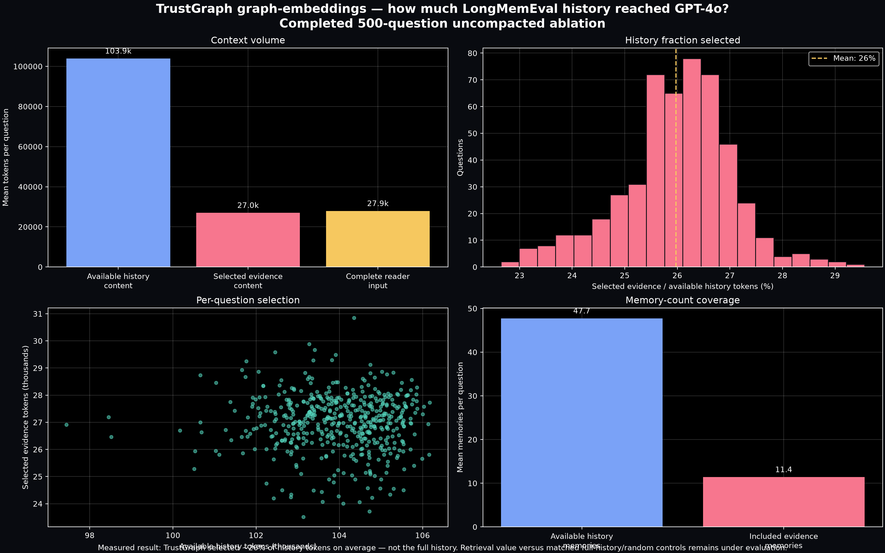
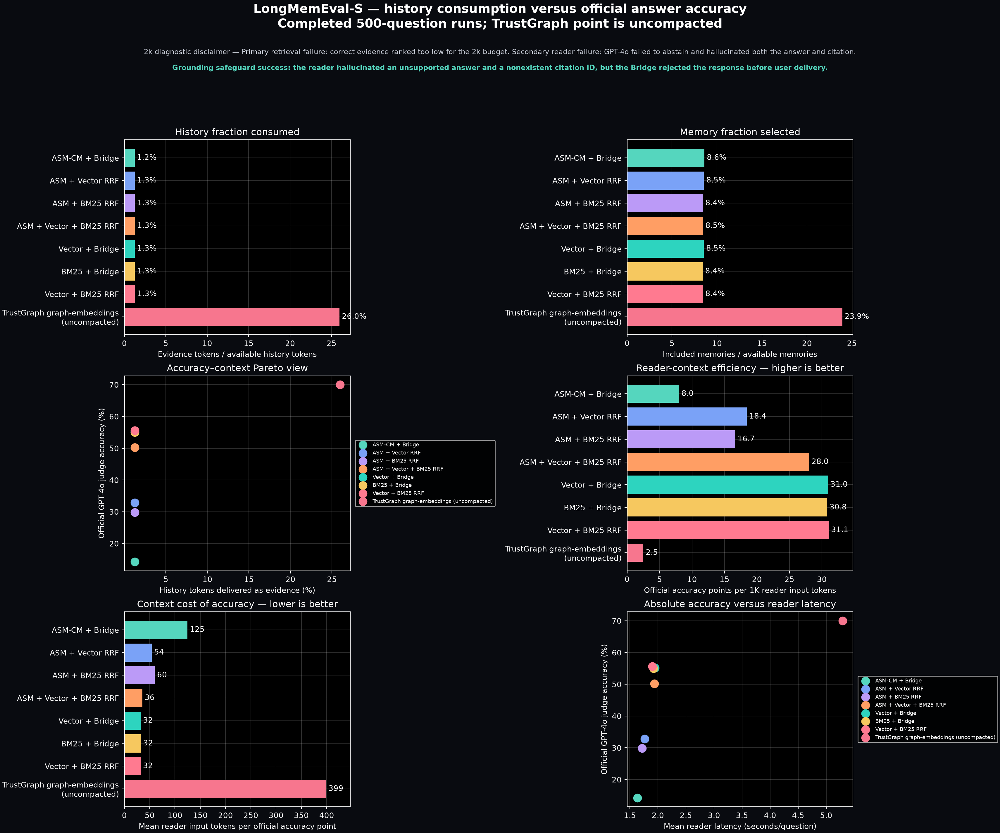

# LongMemEval-S fixed-context control — implementation record

## Status

The fixed-context control is implemented, tested and running as a resumable background
service. At the recorded inspection on 2026-08-11, both the corrected compact
TrustGraph rerun and the fixed-context control were active. The fixed-context artifact
contained 49 of 12,500 reader rows. This count is a progress snapshot, not a result.

No accuracy conclusion is authorized until the reader matrix and official evaluation
are complete.

At row 542, configuration `vector_bridge81`, budget 16k, question `8ebdbe50`, the
GPT-4o reader returned output that failed the required JSON contract on all five internal
attempts. The process stopped without writing a partial row; the atomic checkpoint
remained valid at 541 rows. This is recorded as a reader-output protocol failure, not a
retrieval failure. Restarting the same command retries the missing key and does not
repeat completed rows.

At row 951, configuration `asm_bridge81`, budget 2k, question `577d4d32`, the GPT-4o
reader cited a memory ID outside the authorized evidence package on all five internal
attempts. The Bridge correctly rejected every response under its fail-closed provenance
contract. No row was written and the checkpoint remained valid at 950 rows. This is a
reader citation-contract failure, not evidence that ASM retrieval itself failed. The
recovery procedure increases retry count for the missing row while retaining the same
reader, evidence, validation policy and frozen benchmark protocol; invalid citations are
not silently stripped or accepted.

The subsequent raw-response diagnostic identified the exact failure chain. The gold
memory (`memory:577d4d32:answer_0dd4d99a`, containing the supported answer `7 pm`) was
present only at rank 14 of the frozen ASM ranking. The 2k pack admitted only rank 1,
`memory:577d4d32:a126eeab_3`, an unrelated dance-playlist conversation. GPT-4o should
therefore have abstained. Instead it answered `9 PM` and cited
`memory:577d4d32:a126eeab_1`. That cited ID does not exist anywhere in the question's
46-memory history; it appears to be a fabricated mutation of the allowed `_3` suffix.
This rules out an API-key problem, a parser error, and a hidden reference to the cited ID
inside the evidence. The upstream ranking/budget combination failed to expose the gold
fact, and the reader then independently violated both grounding and citation contracts.
The Bridge rejection was correct.

The runner now applies a frozen continuation policy after the configured attempts are
exhausted. It preserves every observable raw model output and usage counter, records the
last parseable prediction as an incorrect `reader_contract_failure`, stores invalid IDs,
and continues to the next key. Malformed or absent output becomes a fail-closed
abstention. Such rows remain in denominators and in the official hypotheses; they are not
skipped, repaired, or silently converted into successful answers. Per-attempt aggregate
token fields are stored separately from the final-response token fields so operational
retry cost remains observable.

The active five-system run will not be interrupted. After it completes, three previously
measured ASM hybrid rankings will be added through the same checkpoint: ASM+Vector RRF,
ASM+BM25 RRF and ASM+Vector+BM25 RRF. This expands the final matrix from 12,500 to 20,000
retriever reader answers without repeating completed system/budget/question keys. Two
matched non-retrieval controls—canonical full-history truncation and deterministic random
history—add another 5,000 answers, producing 25,000 final reader rows.

The default launcher remains frozen to the original five-system stage. The expanded
stage is opt-in with `scripts/run_longmemeval_fixed_context.sh --expanded`; this prevents
a restart after an ordinary reader failure from introducing new systems before the core
matrix completes.

## What was corrected

The first completed TrustGraph LongMemEval-S graph-embeddings artifact did not apply the
Bridge 8.1 evidence transform. Its 70.00% official accuracy and 27,928.1 mean input
tokens remain measured facts, but the run is now classified as:

> TrustGraph graph-embeddings (uncompacted high-context ablation)

It must not be described as using the same compactor as the seven compact internal
systems. The original artifact remains unchanged for auditability. The corrected compact
run writes to `tg-longmemeval-s-500-graph-embeddings-bridge81-gpt4o.json`.

## Implemented experiment

The new control crosses five frozen rankings with five evidence budgets:

| Rankings | Evidence budgets |
|---|---|
| ASM-CM + Bridge 8.1 | 2k, 4k, 8k, 16k, 28k |
| Vector + Bridge 8.1 | 2k, 4k, 8k, 16k, 28k |
| BM25 + Bridge 8.1 | 2k, 4k, 8k, 16k, 28k |
| Vector + BM25 RRF + Bridge 8.1 | 2k, 4k, 8k, 16k, 28k |
| TrustGraph graph-embeddings | 2k, 4k, 8k, 16k, 28k |
| ASM + Vector RRF + Bridge 8.1 | 2k, 4k, 8k, 16k, 28k |
| ASM + BM25 RRF + Bridge 8.1 | 2k, 4k, 8k, 16k, 28k |
| ASM + Vector + BM25 RRF + Bridge 8.1 | 2k, 4k, 8k, 16k, 28k |
| Canonical full history, truncated | 2k, 4k, 8k, 16k, 28k |
| Deterministic random history | 2k, 4k, 8k, 16k, 28k |

All configurations use the same 500 questions, top-15 frozen rankings, GPT-4o reader
and official GPT-4o judge. Ranking and context allocation are gold-blind.

The limit applies to evidence-content tokens under `o200k_base`. Provider-reported total
input tokens are recorded separately because the complete prompt also contains the
system instruction, question, provenance fields and formatting.

## Validation

- tokenizer dependency installed explicitly;
- unit test verifies that packed evidence never exceeds its budget;
- complete repository test suite: 41 passed;
- smoke: one question × five systems at 2k completed 5/5;
- observed total inputs in the smoke: 2,271–2,345 tokens, consistent with the 2k
  evidence allowance plus prompt/provenance overhead;
- canonical run writes an atomic checkpoint after every reader answer;
- resume is rejected if the frozen protocol changes.

## Operational separation

The control reads completed ASM and TrustGraph ranking artifacts. It does not attach to,
stop, restart or mutate an existing ASM-CM process. It performs new GPT-4o reader calls
in a separate process. Retrieval latency is excluded because retrieval is replayed from
frozen IDs.

## Publication rule

Until completion, charts may describe the protocol and show the prior uncompacted point,
but may not show partial fixed-budget accuracy as a final result. After completion, the
publication should plot accuracy against both enforced evidence budget and measured
total reader input, with every system on the same axes.

Full frozen methodology:
[longmemeval_fixed_context_budget.md](../../methodology/longmemeval_fixed_context_budget.md).

## Offline TrustGraph context coverage

The completed uncompacted TrustGraph artifact was also analyzed without new model calls.
Across 500 questions, the history contained a mean 103,936 `o200k_base` content tokens
and 47.7 memories. TrustGraph included a mean 26,993 content tokens and 11.4 memories:
approximately 26.0% of available history tokens and 23.9% of memories. The complete
provider-reported reader input averaged 27,928 tokens after prompt and provenance
overhead.

Therefore, the evidence does **not** support saying that TrustGraph sent the entire
history. It sent a large but selective fraction. Whether that selection adds value over
budget-matched full-history or random ordering remains the question tested by the new
controls.

## Symmetric consumption and accuracy comparison

The same offline accounting was applied to all seven completed compact systems and the
uncompacted TrustGraph run. Evidence consumption is measured as exact evidence bytes
divided by the complete history bytes for each question. Reader consumption uses the
provider-reported input tokens.

| System | History tokens consumed | Official accuracy | Input tokens/q | Accuracy points / 1k tokens |
|---|---:|---:|---:|---:|
| ASM-CM + Bridge | 1.24% | 14.20% | 1,770 | 8.0 |
| ASM + Vector RRF | 1.25% | 32.80% | 1,779 | 18.4 |
| ASM + BM25 RRF | 1.27% | 29.80% | 1,789 | 16.7 |
| ASM + Vector + BM25 RRF | 1.27% | 50.20% | 1,790 | 28.0 |
| Vector + Bridge | 1.25% | 55.20% | 1,782 | 31.0 |
| BM25 + Bridge | 1.26% | 55.00% | 1,784 | 30.8 |
| Vector + BM25 RRF | 1.26% | 55.60% | 1,789 | **31.1** |
| TrustGraph graph-embeddings (uncompacted) | 25.97% | **70.00%** | 27,928 | 2.5 |

Relative to Vector + BM25 RRF, TrustGraph gained 14.4 official-accuracy points while
using approximately 15.6 times as many reader input tokens and delivering approximately
20.5 times the fraction of history as evidence. Its measured context efficiency was
about 12.4 times lower: 2.5 versus 31.1 accuracy points per 1,000 reader input tokens.

This does not prove that TrustGraph retrieval adds no value. It establishes that the
observed 70% endpoint purchased a moderate absolute accuracy improvement with a much
larger context allowance. The fixed-budget canonical-history and random-history controls
are required to isolate the value of the ordering itself.

