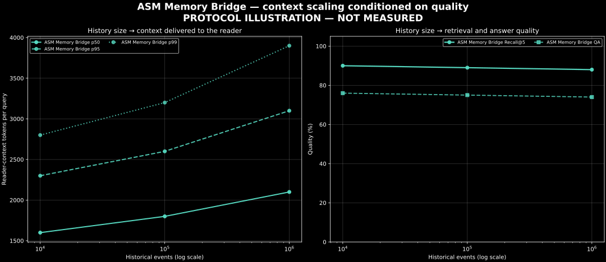

# Reader-context scaling conditioned on quality

## Central question

> As history grows, how much context must ASM Memory Bridge deliver to the
> reader while preserving retrieval and answer quality?

This protocol is scoped only to **ASM Memory Bridge**; it does not compare the
system with TrustGraph or any other baseline. The central result is a pair of
aligned curves. The first shows historical
events against reader-context tokens per query at p50, p95 and p99. The second
shows the corresponding Recall@5 and QA score. A token reduction is publishable
as an efficiency result only when quality is matched or improved.



The image above is deliberately watermarked **PROTOCOL ILLUSTRATION — NOT
MEASURED**. Its values are synthetic and must never be cited as benchmark
results. It documents the chart contract while the 10k, 100k and 1M paired runs
are pending.

## Frozen observation schema

Each query produces one JSON or JSONL observation:

```json
{
  "system": "asm_memory_bridge",
  "history_events": 10000,
  "reader_context_tokens": 1834,
  "recall_at_5": 1.0,
  "qa_score": 0.8
}
```

`reader_context_tokens` is the complete serialized reader input measured with
the reader's exact tokenizer. It includes instructions, question, evidence and
formatting. Evidence-only tokens may be recorded as an additional field, but
must not replace this value. `recall_at_5` is a per-query 0/1 observation;
`qa_score` is a per-query score normalized to `[0, 1]`.

For every `(system, history_events)` cell, preserve raw query rows and report:

| Context distribution | Quality | Required audit fields |
|---|---|---|
| p50, p95, p99, mean | Recall@5, mean QA score | n, reader/tokenizer, prompt hash, workload hash, seed |

At least 1,000 evaluated queries per cell is preferred for a stable p99. With a
smaller sample, p99 remains descriptive and its sample size must accompany it.
Do not pool repeated runs before checking run-to-run drift.

## Checkpoints and pairing

The primary checkpoints are 10k, 100k and 1M events. ASM Memory Bridge receives
the same cumulative event stream and the same query set at each checkpoint. Reader model,
prompt, tokenizer, generation parameters, top-k and evidence policy are frozen.
If an architecture cannot complete a checkpoint, report the failure rather than
carrying its previous value forward.

The quality gate uses either:

1. a fixed quality floor declared before the run; or
2. operating points produced by sweeping the ASM Memory Bridge retrieval/context
   budget.

The second option produces an internal Pareto frontier. For each history
checkpoint, report the minimum context p95 required to reach the pre-registered
Recall@5 and QA thresholds. Never select a threshold after inspecting the run.

## Generate the result

```bash
pmsb-reader-context-scaling \
  --input results/raw/reader-context-scaling.jsonl \
  --summary results/derived/reader-context-scaling.json \
  --png docs/screens/reader-context-scaling.png \
  --svg docs/screens/reader-context-scaling.svg
```

The command rejects missing fields, negative token counts, and quality values
outside `[0, 1]`. A generated summary is marked `measured`; projected history
points belong in a separate artifact and must not be connected as observations.

## Publication table

Publish one row per measured ASM Memory Bridge checkpoint:

| History | System | Context p50 | Context p95 | Context p99 | Recall@5 | QA score | n |
|---:|---|---:|---:|---:|---:|---:|---:|

The defensible headline is not “50% fewer tokens.” It is, for example:

> ASM Memory Bridge kept reader-context p95 at X tokens at the 100k-event
> checkpoint while meeting the pre-registered Recall@5 and QA floor.

Until both the distribution and its adjacent quality curve exist, no economic
scaling claim is complete.
