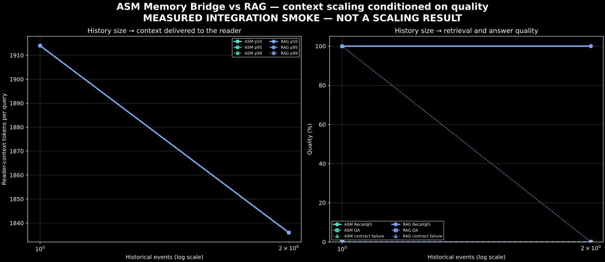

# Reader-context scaling conditioned on quality

## Central question

> As history grows, how much context must ASM Memory Bridge deliver to the
> reader while preserving retrieval and answer quality?

This protocol is scoped only to **ASM Memory Bridge**; it does not compare the
system with TrustGraph or any other baseline. The central result is a pair of
aligned curves. The first shows historical
events against reader-context tokens per query at p50, p95 and p99. The second
shows the corresponding Recall@5 and QA score. A token reduction is publishable
as an efficiency result only when quality is matched or improved.


The image above is deliberately watermarked **PROTOCOL ILLUSTRATION — NOT
MEASURED**. Its values are synthetic and must never be cited as benchmark
results. It documents the chart contract while the 10k, 100k and 1M paired runs
are pending.

## Frozen observation schema

Each query produces one JSON or JSONL observation:

```json
{
  "system": "asm_memory_bridge",
  "history_events": 10000,
  "reader_context_tokens": 1834,
  "recall_at_5": 1.0,
  "qa_score": 0.8
}
```

`reader_context_tokens` is the complete serialized reader input measured with
the reader's exact tokenizer. It includes instructions, question, evidence and
formatting. Evidence-only tokens may be recorded as an additional field, but
must not replace this value. `recall_at_5` is a per-query 0/1 observation;
`qa_score` is a per-query score normalized to `[0, 1]`.

For every `(system, history_events)` cell, preserve raw query rows and report:

| Context distribution | Quality | Required audit fields |
|---|---|---|
| p50, p95, p99, mean | Recall@5, mean QA score | n, reader/tokenizer, prompt hash, workload hash, seed |

At least 1,000 evaluated queries per cell is preferred for a stable p99. With a
smaller sample, p99 remains descriptive and its sample size must accompany it.
Do not pool repeated runs before checking run-to-run drift.

## Checkpoints and pairing

The primary checkpoints are 10k, 100k and 1M events. ASM Memory Bridge receives
the same cumulative event stream and the same query set at each checkpoint. Reader model,
prompt, tokenizer, generation parameters, top-k and evidence policy are frozen.
If an architecture cannot complete a checkpoint, report the failure rather than
carrying its previous value forward.

### Frozen local reader

Both ASM Memory Bridge and the RAG baseline use the local Ollama reader defined in
[`configs/asm-memory-bridge/qwen35-local-reader.json`](../configs/asm-memory-bridge/qwen35-local-reader.json):

- model: `qwen3.5:0.8b` (`Q8_0`), served by `http://127.0.0.1:11434`;
- `num_ctx=32768`, `temperature=0`, `seed=1`, `think=false`;
- structured JSON output and at most 256 generated tokens;
- complete reader-context consumption taken from Ollama's measured
  `prompt_eval_count`, never estimated with a different tokenizer.

`qwen3.5:cloud` is explicitly excluded: it is not a local reader. The model ID,
Ollama version and model metadata must be captured again in every run manifest.

### Paired RAG baseline

The comparative result uses an explicit full-history lexical RAG baseline backed
by SQLite FTS5/BM25. It ingests the identical TG-2 event prefix and evaluates the
same checkpoint/query pairs with `top_k=5`, the same evidence serialization,
grounded prompt and Qwen3.5 reader. The paired renderer rejects mismatched query
sets or reader model identifiers.

Context efficiency is claimed only where Recall@5 and QA meet the same
pre-registered floor. Otherwise, the chart reports the trade-off without calling
the token difference an economic win. The existing Phase 8.1 ASM-only result is
therefore a promising context-efficiency result, not proof of savings versus RAG.
Reader contract failures are scored incorrect and their consumption includes all
measured retry attempts; dropping retries would understate operational token cost.

The quality gate uses either:

1. a fixed quality floor declared before the run; or
2. operating points produced by sweeping the ASM Memory Bridge retrieval/context
   budget.

The second option produces an internal Pareto frontier. For each history
checkpoint, report the minimum context p95 required to reach the pre-registered
Recall@5 and QA thresholds. Never select a threshold after inspecting the run.

## Generate the result

No external dataset download is required for the scaling curve. The runner uses
the deterministic, bilingual TG-2 event generator and freezes the query set from
the 10k prefix. The exact same questions are evaluated again after 100k and 1M
events, so the curve measures retention under added history rather than a change
in question difficulty.

Run the complete paired protocol from the repository root:

```bash
./scripts/run_paired_reader_context_scaling.sh
```

The default run performs 1,000 local-reader calls at each of the three
checkpoints. It writes resumable ingestion snapshots and fsyncs every completed
query. Re-running the same command continues the existing run in
`results/raw/asm-reader-context-scaling-qwen35/`.

Use a small end-to-end smoke before the official run:

```bash
CHECKPOINTS=1,2 QUERIES=3 CHUNK_SIZE=1 \
RUN_ROOT=results/raw/paired-reader-context-scaling-qwen35-smoke \
./scripts/run_paired_reader_context_scaling.sh
```

The real integration smoke measured roughly 22–25 seconds per ingested event in
the current scalar neural append path. At that rate, the official 1M run is not
operationally reasonable. The wrapper refuses checkpoints above 1,000 unless
`ALLOW_LONG_RUN=1` is set deliberately. This guard must not be removed merely to
produce a nominal launch; the ASM backend needs a measured batched-ingestion path
before the large checkpoints are practical.

The paired renderer itself was validated end to end with a two-checkpoint,
three-query diagnostic smoke:



This chart is intentionally labeled **not a scaling result**. Both retrievers
returned the same tiny evidence set, and the Qwen3.5 0.8B reader failed the QA
floor; no efficiency or economic conclusion is authorized from it.

The output contains separate `asm/` and `rag/` evidence, summaries and stores,
plus `asm-vs-rag.png`, `asm-vs-rag.svg` and `paired-summary.json` at the run root.

## MultiWOZ with controlled distractors

For an in-domain ASM retrieval test, use the separate MultiWOZ runner. It freezes
the supported Phase-8 test questions and relevant dialogue set, then grows only
a deterministic prefix of dialogues from the disjoint MultiWOZ training split.
Checkpoints therefore change history size without changing question difficulty.
Both systems receive the same ordered corpus, questions, `top_k` and Ollama
reader (`qwen3:14b`, temperature zero, thinking disabled).

The runner measures three reader paths: `ASM Memory Bridge`, `ASM Memory Bridge
(compact)`, and `RAG (SQLite FTS5/BM25)`. The compact path applies the frozen
Phase-8.1 query-conditioned extractive limits (6,144 total bytes, 1,536 bytes per
memory, six anchors and radius two) to the exact same ASM retrieval candidates.
The compactor cannot inspect the reference answer.

```bash
DISTRACTORS=0,10 QUERIES=5 CHUNK_SIZE=5 \
RUN_ROOT=results/raw/paired-multiwoz-distractors-qwen3-14b-pilot \
./scripts/run_multiwoz_distractor_scaling.sh
```

The `0` checkpoint is essential: it measures the fixed relevant history before
any distractor is added. Later checkpoints are cumulative prefixes of one frozen
distractor stream. Raw observations record both total `history_events` (documents
in this protocol) and `distractor_count`.

For the quality-matched run, `TOP_K_VALUES=5,10,20` is frozen before execution.
At each history checkpoint the runner selects the smallest K reaching both
Recall ≥ 90% and QA ≥ 65%. It writes the complete measurements to
`top-k-sweep-summary.json` and only eligible operating points to
`quality-matched-summary.json` and `quality-matched.png`.

To render another conforming JSONL independently:

```bash
pmsb-reader-context-scaling \
  --input results/raw/reader-context-scaling.jsonl \
  --summary results/derived/reader-context-scaling.json \
  --png docs/screens/reader-context-scaling.png \
  --svg docs/screens/reader-context-scaling.svg
```

The command rejects missing fields, negative token counts, and quality values
outside `[0, 1]`. A generated summary is marked `measured`; projected history
points belong in a separate artifact and must not be connected as observations.

## Publication table

Publish one row per measured ASM Memory Bridge checkpoint:

| History | System | Context p50 | Context p95 | Context p99 | Recall@5 | QA score | n |
|---:|---|---:|---:|---:|---:|---:|---:|

The defensible headline is not “50% fewer tokens.” It is, for example:

> ASM Memory Bridge kept reader-context p95 at X tokens at the 100k-event
> checkpoint while meeting the pre-registered Recall@5 and QA floor.

Until both the distribution and its adjacent quality curve exist, no economic
scaling claim is complete.
